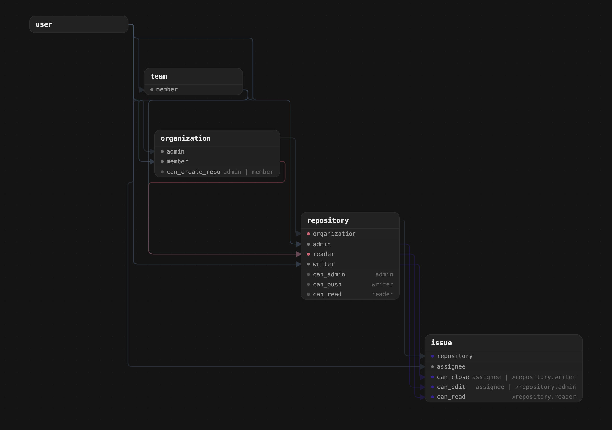

<div align="center">

# OpenFGA Viewer

Visual graph explorer for [OpenFGA](https://openfga.dev) authorization models.

[](https://openfga-viewer.vercel.app)
[](https://github.com/thecodingcrow/openfga-viewer/releases)
[](./LICENSE)

**Live demo:** [openfga-viewer.vercel.app](https://openfga-viewer.vercel.app)

[](https://openfga-viewer.vercel.app)

</div>

---

## Features

- **DSL Editor** — Inline FGA editor with syntax highlighting and autocomplete
- **Graph Visualization** — Interactive dependency graph powered by React Flow and ELK layout
- **Focus Modes** — Full graph, type neighborhood, and relation path tracing
- **Node Filters** — Filter by node type (types, relations, permissions)
- **File Import** — Drag-and-drop `.fga` file loading
- **Keyboard Shortcuts** — Quick access via `Ctrl/Cmd+E` to toggle the editor

---

## Getting Started

**Prerequisites:** Node.js 18+

```sh
# Clone and install
git clone https://github.com/thecodingcrow/openfga-viewer.git
cd openfga-viewer
npm install

# Development
npm run dev       # Start dev server
npm run build     # Type-check and build for production
npm run lint      # Run ESLint
npm run preview   # Preview production build
```

## Tech Stack

| Category  | Technology                    |
|-----------|-------------------------------|
| Framework | React 19 + TypeScript 5.9     |
| Build     | Vite 7                        |
| Graph     | React Flow v12 + elkjs        |
| State     | Zustand 5                     |
| Editor    | CodeMirror 6                  |
| Styling   | Tailwind CSS v4               |

## Contributing

Contributions welcome! Open an issue or submit a PR.

---

## Author

Elias Martinek — [martinek.dev@gmail.com](mailto:martinek.dev@gmail.com)

## License

[AGPL-3.0](./LICENSE)
